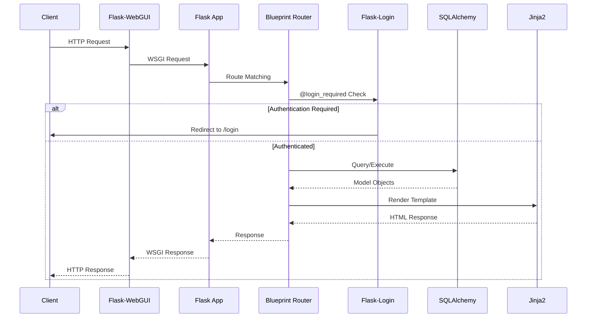
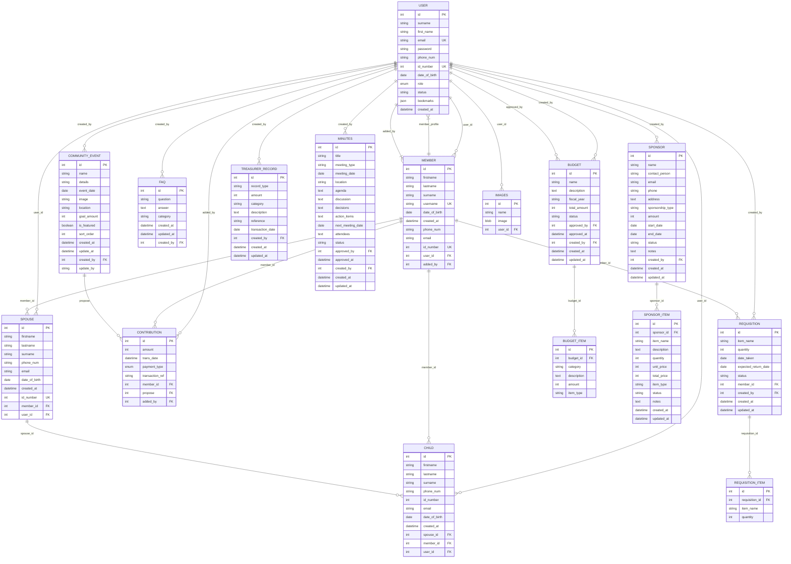
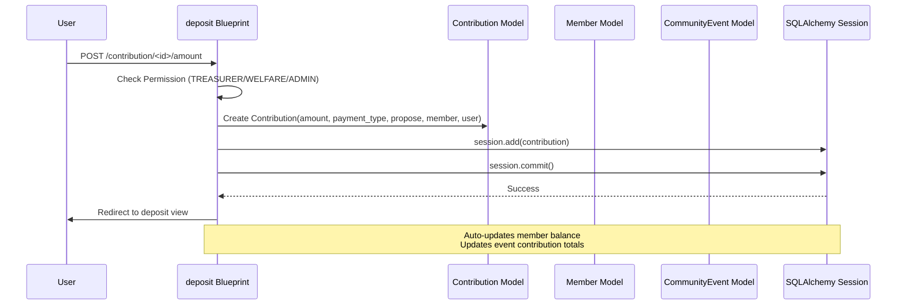
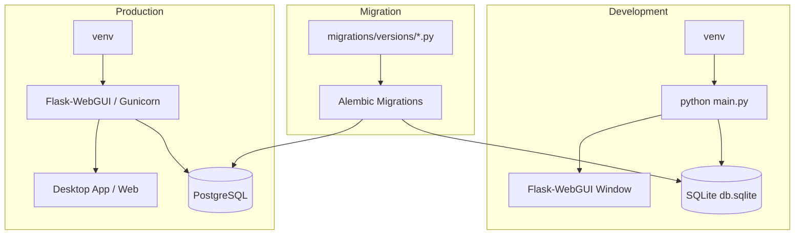

# GameRock - Architecture Documentation

## 2.1 High-Level Architecture

```mermaid
graph TB
    subgraph "Client Layer"
        UI[Flask-WebGUI Desktop App<br/>Electron-like Wrapper]
        WEB[Web Browser<br/>Standard HTTP Client]
    end

    subgraph "Application Layer"
        WSGI[WSGI Server<br/>Flask Development Server / Waitress / Gunicorn]
        APP["Flask Application Factory<br/>create_app()"]
        
        subgraph "Blueprints"
            AUTH[auth<br/>Authentication (Email/Role Lookup)]
            MAIN[main<br/>Core Entry & Routing]
            HOME[home<br/>Role-Based Dashboards]
            REG[register<br/>Member/Member Management]
            DEP[deposit<br/>Contributions & Deposits]
            FAM[family<br/>Spouse, Child, Member Relations]
            COM[community<br/>Events, FAQs, Members]
            BUD[budget<br/>Budget Management]
            TRE[treasurer<br/>Treasury Records]
            MIN[minutes<br/>Meeting Minutes]
            REQ[requisition<br/>Item Requisitions]
            SPO[sponsor<br/>Sponsor Management]
            REP[reports<br/>Analytics & Reports]
            ACC[account<br/>User/Role Administration]
        end
    end

    subgraph "Service Layer"
        DB[(SQLAlchemy ORM<br/>Models & Relationships)]
        MIG[Alembic Migrations]
        LOGIN[Flask-Login<br/>Session Management]
        JINJA[Jinja2<br/>Template Rendering]
        BOOT[Flask-Bootstrap<br/>UI Components]
        IMG[Image Service<br/>Upload & MIME Detection]
        LEVEL[AccessLevel Enum<br/>RBAC Logic]
    end

    subgraph "Data Layer"
        PG[(PostgreSQL<br/>Primary)]
        MYSQL[(MySQL<br/>Alternative)]
        SQLITE[(SQLite<br/>Development)]
    end

    subgraph "Active Config"
        CFG[Single Active DB<br/>Selected at startup via<br/>SQLALCHEMY_DATABASE_URI]
    end

    UI --> WSGI
    WEB --> WSGI
    WSGI --> APP
    APP --> AUTH
    APP --> MAIN
    APP --> HOME
    APP --> REG
    APP --> DEP
    APP --> FAM
    APP --> COM
    APP --> BUD
    APP --> TRE
    APP --> MIN
    APP --> REQ
    APP --> SPO
    APP --> REP
    APP --> ACC
    
    AUTH --> DB
    AUTH --> LEVEL
    AUTH --> LOGIN
    MAIN --> JINJA
    MAIN --> BOOT
    HOME --> DB
    HOME --> LEVEL
    REG --> DB
    REG --> LEVEL
    REG --> IMG
    DEP --> DB
    DEP --> LEVEL
    FAM --> DB
    COM --> DB
    COM --> LEVEL
    BUD --> DB
    BUD --> LEVEL
    TRE --> DB
    MIN --> DB
    MIN --> LEVEL
    REQ --> DB
    REQ --> LEVEL
    SPO --> DB
    SPO --> LEVEL
    REP --> DB
    ACC --> DB
    ACC --> LEVEL
    
    APP --> LOGIN
    APP --> LEVEL
    APP --> JINJA
    APP --> BOOT
    APP --> IMG
    
    DB --> MIG
    DB --> CFG
    CFG --> PG
    CFG --> MYSQL
    CFG --> SQLITE
```

## 2.2 Request Flow Architecture



## 2.3 Database Schema - Entity Relationship Diagram



## 2.4 Role-Based Access Control Flow

The RBAC system is built on the `AccessLevel` enum (`app/level.py`), which defines seven roles with a hierarchical level property. While the enum defines permission properties (`is_admin`, `is_finance`, `is_member_admin`, `is_welfare`, `is_sponsor_admin`), these are not used directly in enforcement. Instead, the system enforces permissions through **role name string lists** checked in route handlers, template globals, and template conditionals. Role assignment is stored on the `User` model via the `role` column.

```mermaid
flowchart TD
    Request[Incoming Request] -->     AuthCheck{"@login_required"}
    AuthCheck -->|Not Authenticated| Login[Redirect to /auth/index]
    AuthCheck -->|Authenticated| RoleCheck{Check current_user.role.name}

    RoleCheck -->|DEVEL or ADMIN| FullAccess[Full System Access<br/>All permissions]
    RoleCheck -->|CHAIRPERSON| ChairAccess[Budgets, Minutes,<br/>Requisitions, Sponsors, Events<br/>Member Management]
    RoleCheck -->|TREASURER| TreasurerAccess[Treasury, Deposits,<br/>Contributions, Register]
    RoleCheck -->|SECRETARY| SecretaryAccess[Minutes, Member Management,<br/>Pending Users]
    RoleCheck -->|WELFARE_OFFICER| WelfareAccess[Contributions,<br/>Deposits, Register, Family Access]
    RoleCheck -->|USER| UserAccess[Own Dashboard,<br/>Contribution Record,<br/>Family Network]

    FullAccess --> PermissionCheck{Permission Check<br/>via role name list}
    ChairAccess --> PermissionCheck
    TreasurerAccess --> PermissionCheck
    SecretaryAccess --> PermissionCheck
    WelfareAccess --> PermissionCheck
    UserAccess --> PermissionCheck

    PermissionCheck -->|Template Globals<br/>app/__init__.py:344-363| TemplateChecks
    PermissionCheck -->|Route Functions<br/>bp/routes.py| RouteChecks

    TemplateChecks -->|is_admin_or_dev<br/>['DEVEL', 'ADMIN']| AdminUI[Admin UI Elements]
    TemplateChecks -->|can_manage_minutes<br/>['DEVEL', 'ADMIN', 'SECRETARY']| MinutesUI[Minute Controls]
    TemplateChecks -->|can_manage_treasurer<br/>['DEVEL', 'ADMIN', 'TREASURER']| TreasuryUI[Treasury Controls]
    TemplateChecks -->|can_manage_requisition<br/>['DEVEL', 'ADMIN', 'CHAIRPERSON']| ReqnUI[Requisition Controls]

    RouteChecks -->|Budget: ['DEVEL', 'ADMIN']<br/>['DEVEL', 'ADMIN', 'CHAIRPERSON']| BudgetRoutes[Budget Pages]
    RouteChecks -->|Treasurer: ['DEVEL', 'ADMIN', 'TREASURER']<br/>['DEVEL', 'ADMIN']| TreasuryRoutes[Treasury Pages]
    RouteChecks -->|Minutes: ['DEVEL', 'ADMIN', 'SECRETARY']<br/>['DEVEL', 'ADMIN']| MinutesRoutes[Minutes Pages]
    RouteChecks -->|Sponsor: ['DEVEL', 'ADMIN', 'CHAIRPERSON']| SponsorRoutes[Sponsor Pages]
    RouteChecks -->|Requisition: ['DEVEL', 'ADMIN', 'CHAIRPERSON']| ReqnRoutes[Requisition Pages]
    RouteChecks -->|Register: ['DEVEL', 'ADMIN']<br/>['DEVEL', 'ADMIN', 'WELFARE_OFFICER', 'TREASURER']| RegisterRoutes[Member Pages]

    BudgetRoutes --> ContextProcessor[Global Context Injection]
    TreasuryRoutes --> ContextProcessor
    MinutesRoutes --> ContextProcessor
    SponsorRoutes --> ContextProcessor
    ReqnRoutes --> ContextProcessor
    RegisterRoutes --> ContextProcessor
    AdminUI --> ContextProcessor
    MinutesUI --> ContextProcessor
    TreasuryUI --> ContextProcessor
    ReqnUI --> ContextProcessor

    ContextProcessor --> Template[Render Template with<br/>Role-Aware Data Scope]
    Template --> Render[Final HTML]
```

### Permission Hierarchy

The `AccessLevel` enum (`app/level.py`) defines a conceptual level hierarchy (DEVEL=5, ADMIN=CHAIRPERSON=4, others=3, USER=1), but actual enforcement uses explicit role lists. The `level` property and boolean properties (`is_admin`, `is_finance`, etc.) are defined for documentation purposes but are not used in enforcement.

| Role Enum | Role Value | Level | Conceptually Grants |
|-----------|-----------|-------|---------------------|
| DEVEL | Developer | 5 | Full unrestricted access |
| ADMIN | Administrator | 4 | Full unrestricted access |
| CHAIRPERSON | Chairperson | 4 | Budget, Minutes, Requisitions, Sponsors |
| TREASURER | Treasurer | 3 | Treasury, Budgets, Deposits, Contributions |
| SECRETARY | Secretary | 3 | Minutes, Member Management |
| WELFARE_OFFICER | Welfare Officer | 3 | Contributions, Deposits, Welfare events |
| USER | User | 1 | Own dashboard, family network access |

### Permission Enforcement

Permissions are enforced through three complementary mechanisms:

1. **Template globals** (`app/__init__.py:344-363`): Functions like `is_admin_or_dev`, `can_manage_minutes`, `can_manage_treasurer`, `can_manage_requisition` are available in all templates and check `current_user.role.name` against explicit role lists. Template filters `mask_phone` and `mask_id` (`app/__init__.py:370-388`) enforce data masking for non-admin roles.

2. **Route-level functions**: Each blueprint module defines local permission check functions:
   - `budget/routes.py`: `is_admin_or_dev()` (DEVEL, ADMIN), `can_view_budget()` (DEVEL, ADMIN, CHAIRPERSON)
   - `treasurer/routes.py`: `can_manage_treasurer()` (DEVEL, ADMIN, TREASURER), `is_admin_or_dev()` (DEVEL, ADMIN)
   - `minutes/routes.py`: `can_manage_minutes()` (DEVEL, ADMIN, SECRETARY), `is_admin_or_dev()` (DEVEL, ADMIN)
   - `sponsor/routes.py`: `can_manage_sponsor()` (DEVEL, ADMIN, CHAIRPERSON)
   - `requisition/routes.py`: `can_manage_requisition()` (DEVEL, ADMIN, CHAIRPERSON)
   - `register/routes.py`: Multiple checks including role assignment (DEVEL, ADMIN) and welfare/deposit access (DEVEL, ADMIN, WELFARE_OFFICER, TREASURER)

3. **Context processor scoping** (`app/__init__.py:165-326`): The `inject_global_variables` context processor runs on every request and applies different data scopes:
   - DEVEL/ADMIN: All members, full dashboard statistics (faq_count, pending counts, recent updates)
   - Authenticated users with `member_profile`: Family-scoped data via `spouse_link`/`child_link` relationships
   - Other authenticated users: Limited data with family network awareness

### User-to-Family Network Access

Non-admin users access family data through the `User` model's relationships:
- `spouse` (uselist=False): Links a User to a Spouse record, which references a Member via `member_id`
- `child` (uselist=False): Links a User to a Child record, which references a Member via `member_id`
- `member_profile` (uselist=False): Links a User to a Member record via `user_id`

The context processor (`app/__init__.py:261-298`) uses these relationships to provide family-scoped data. When a User is a spouse or child, the system resolves their associated Member via the `member_id` FK on Spouse/Child, enabling access to birthday pages, contribution records, and family dashboards.

## 2.5 Module Dependency Graph

```mermaid
graph LR
    subgraph "Core"
        INIT[app/__init__.py]
        AUTH[app/auth.py]
        USER[app/user.py]
        LEVEL[app/level.py]
        IMAGE[app/image.py]
        MAIN[app/main.py]
    end

    subgraph "Models"
        MREG[models/register.py]
        MCONT[models/contribute.py]
        MEVENT[models/community_event.py]
        MDEP[models/deposit.py]
        MBUD[models/budget.py]
        MTRE[models/treasurer.py]
        MMIN[models/minutes.py]
        MREQ[models/requisition.py]
        MSPO[models/sponsor.py]
        MFAQ[models/faq.py]
        MSPOU[models/spouse.py]
        MCHILD[models/child.py]
        MPAY[models/payments.py]
        MCR[models/cont_reg.py]
        MCD[models/cont_depo.py]
    end

    subgraph "Blueprints"
        BPHOME[home/routes.py]
        BPREG[register/routes.py]
        BPDEP[deposit/routes.py]
        BPFAM[family/routes.py]
        BPCOM[community/views.py]
        BPBUD[budget/routes.py]
        BPTRE[treasurer/routes.py]
        BPMIN[minutes/routes.py]
        BPREQ[requisition/routes.py]
        BPSPO[sponsor/routes.py]
        BPREP[reports/routes.py]
        BPACC[account/routes.py]
    end

    INIT --> AUTH
    INIT --> USER
    INIT --> LEVEL
    INIT --> IMAGE
    INIT --> MAIN
    INIT --> DB[(SQLAlchemy db)]
    
    DB --> MREG
    DB --> MCONT
    DB --> MEVENT
    DB --> MDEP
    DB --> MBUD
    DB --> MTRE
    DB --> MMIN
    DB --> MREQ
    DB --> MSPO
    DB --> MFAQ
    DB --> MSPOU
    DB --> MCHILD
    DB --> MPAY
    DB --> MCR
    DB --> MCD
    
    AUTH --> USER
    AUTH --> LEVEL
    AUTH --> MREG
    AUTH --> MSPOU
    AUTH --> MCHILD
    
    MAIN --> USER
    MAIN --> LEVEL
    MAIN --> MREG
    MAIN --> MCONT
    MAIN --> MEVENT
    MAIN --> MSPOU
    MAIN --> MCHILD
    MAIN --> MFAQ
    MAIN --> IMAGE
    
    BPHOME --> USER
    BPHOME --> MREG
    BPHOME --> MCONT
    BPHOME --> MEVENT
    BPHOME --> MSPOU
    BPHOME --> MCHILD
    BPHOME --> MBUD
    BPHOME --> MTRE
    BPHOME --> MMIN
    BPHOME --> LEVEL
    
    BPREG --> USER
    BPREG --> LEVEL
    BPREG --> MREG
    BPREG --> MEVENT
    BPREG --> MSPOU
    BPREG --> MCHILD
    BPREG --> MCONT
    BPREG --> MPAY
    BPREG --> MFAQ
    BPREG --> IMAGE
    
    BPDEP --> USER
    BPDEP --> LEVEL
    BPDEP --> MREG
    BPDEP --> MEVENT
    BPDEP --> MSPOU
    BPDEP --> MCHILD
    BPDEP --> MCONT
    BPDEP --> MPAY
    BPDEP --> IMAGE
    
    BPFAM --> USER
    BPFAM --> LEVEL
    BPFAM --> MREG
    BPFAM --> MEVENT
    BPFAM --> MSPOU
    BPFAM --> MCHILD
    
    BPCOM --> USER
    BPCOM --> LEVEL
    BPCOM --> MREG
    BPCOM --> MSPOU
    BPCOM --> MCHILD
    BPCOM --> MCONT
    BPCOM --> MEVENT
    BPCOM --> MPAY
    
    BPBUD --> USER
    BPBUD --> LEVEL
    BPBUD --> MBUD
    
    BPTRE --> USER
    BPTRE --> LEVEL
    BPTRE --> MTRE
    
    BPMIN --> USER
    BPMIN --> LEVEL
    BPMIN --> MMIN
    
    BPREQ --> USER
    BPREQ --> LEVEL
    BPREQ --> MREG
    BPREQ --> MREQ
    
    BPSPO --> USER
    BPSPO --> LEVEL
    BPSPO --> MSPO
    
    BPREP --> USER
    BPREP --> MREG
    BPREP --> MCONT
    BPREP --> MEVENT
    BPREP --> MPAY
    
    BPACC --> USER
    BPACC --> LEVEL
```



## 2.6 Data Flow - Contribution Processing



## 2.7 Security Architecture

```mermaid
graph TB
    subgraph "Authentication"
        HASH[PBKDF2-SHA256<br/>Password Hashing]
        SESSION[Flask-Login<br/>Session Management]
        ROLE[AccessLevel Enum<br/>Role Enumeration]
    end

    subgraph "Authorization"
        DECORATORS[@login_required<br/>Role Check Decorators]
        CONTEXT[Template Globals<br/>is_admin_or_dev, can_manage_*]
        FILTERS[Template Filters<br/>mask_phone, mask_id]
    end

    subgraph "Data Protection"
        MASKING[Phone/ID Masking<br/>Non-admin views]
        VALIDATION[Input Validation<br/>Form & Model Level]
        SQL_INJ[SQLAlchemy ORM<br/>Parameterized Queries]
    end

    subgraph "Configuration"
        SECRET[SECRET_KEY<br/>Session Signing]
        DEBUG[DEBUG=False<br/>Production Mode]
        CACHE[Cache-Control Headers<br/>No-Cache Policy]
    end

    HASH --> SESSION
    SESSION --> DECORATORS
    ROLE --> DECORATORS
    ROLE --> CONTEXT
    MASKING --> FILTERS
    VALIDATION --> SQL_INJ
    SECRET --> SESSION
    DEBUG --> CACHE
```

## 2.8 Deployment Architecture



## 2.9 Key Design Patterns

| Pattern | Implementation | Location |
|---------|---------------|----------|
| **Application Factory** | `create_app()` in `app/__init__.py` | Core initialization |
| **Blueprint Modularity** | 13 blueprints for feature separation | `app/*/routes.py` |
| **Model-View-Controller** | Models in `app/models/`, Views in blueprints, Templates in `app/templates/` | Throughout |
| **Role-Based Access Control** | `AccessLevel` enum + decorators + template globals | `app/level.py`, `app/__init__.py` |
| **Context Processors** | Global template variables injection | `app/__init__.py:165-326` |
| **Template Filters/Globals** | `mask_phone`, `mask_id`, `is_admin_or_dev` | `app/__init__.py:328-397` |
| **Eager Loading** | `joinedload`, `subqueryload` for N+1 prevention | Routes throughout |
| **Database Migration** | Alembic with auto-generation | `migrations/` |
| **Desktop-First** | Flask-WebGUI integration in `main.py` | `main.py` |